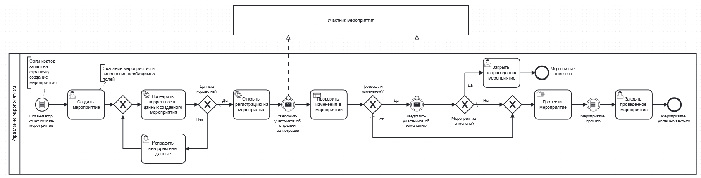
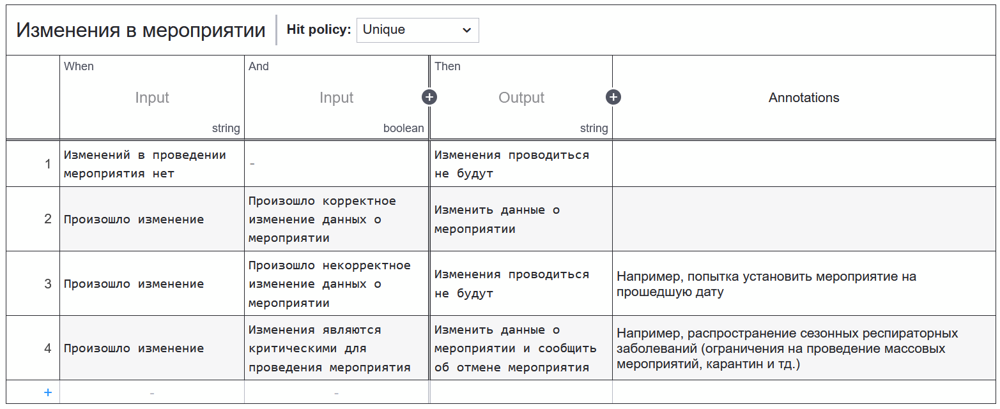

:::note
Описание бизнес-процесса в нотации BPMN
:::

### Модель бизнес-процесса Управление мероприятием в нотации BPMN:

#### DMN таблица:
Таблица DMN необходима для уменьшения сложности модели в нотации BPMN. В данном случае таблица позволяет структурировать информацию об изменениях в мероприятии и более полно представить информацию о произошедших изменениях.
