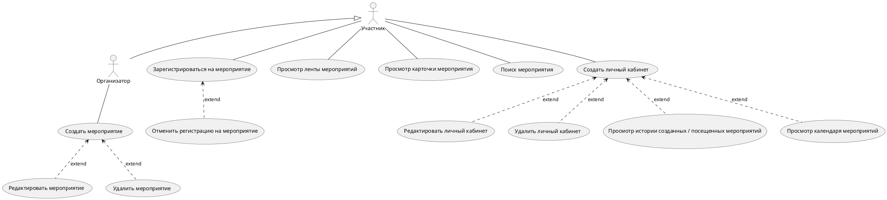
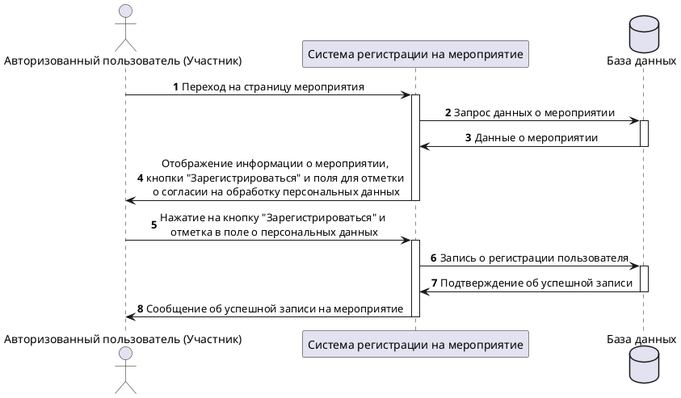

:::note
Use-case и сценарий
:::

### Диаграмма вариантов использования на языке UML:

### Диаграмма последовательности на языке UML:
Диаграмма последовательности для Use-case Регистрация участника на мероприятие

