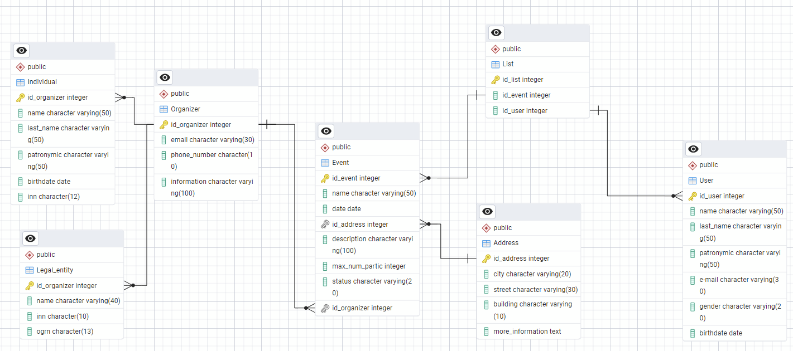

# Модели данных

:::note
Описание модели данных
:::

import Drawio from '@theme/Drawio'
import diagram from '!!raw-loader!./model_con.drawio';
import diagram1 from '!!raw-loader!./model_log.drawio';

### Концептуальная модель базы данных:

<Drawio content={diagram} editable={false} />

| **Атрибут**                | **Описание**                               | **Тип данных** | **Значение по умолчанию** | **Ограничения**                                           | **Обязательность** |
| -------------------------- | ------------------------------------------ | -------------- | ------------------------- | --------------------------------------------------------- | ------------------ |
| _Сущность Организатор_     |                                            |                |                           |                                                           |                    |
| Наименование               | Наименование организатора                  | Текстовый      |                           |                                                           | Да                 |
| E-mail                     | Адрес эл. почты организатора               | Текстовый      |                           |                                                           | Да                 |
| Номер телефона             | Номер телефона организатора                | Текстовый      |                           |                                                           | Да                 |
| Информация об организаторе | Предоставляемая информация об орагнизаторе | Текстовый      |                           |                                                           | Нет                |
| _Сущность Мероприятие_     |                                            |                |                           |                                                           |                    |
| Название                   | Название мероприятия                       | Текстовый      |                           |                                                           | Да                 |
| Дата проведения            | Дата проведения и время                    | Дата           |                           |                                                           | Да                 |
| Место проведения           | Адрес мероприятия                          | Текстовый      |                           |                                                           | Да                 |
| Описание                   | Информация о мероприятии                   | Текстовый      |                           |                                                           | Нет                |
| Макс. кол-во участников    | Кол-во участников для регистрации          | Числовой       |                           |                                                           | Да                 |
| Статус                     |                                            | Текстовый      |                           | Проведено или Регистрация открыта или Регистрация закрыта | Да                 |
| _Сущность участник_        |                                            |                |                           |                                                           |                    |
| ФИО                        |                                            | Текстовый      |                           |                                                           | Да                 |
| E-mail                     | Адрес эл. почты участника                  | Текстовый      |                           |                                                           | Да                 |
| Пол                        |                                            | Текстовый      |                           | М или Ж                                                   | Да                 |
| Дата рождения              |                                            | Дата           |                           |                                                           | Да                 |

### Логическая модель базы данных:

<Drawio content={diagram1} editable={false} />

### Физическая модель базы данных:

